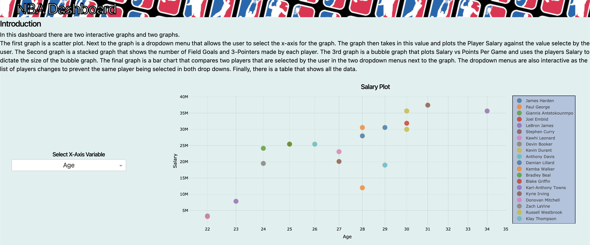

# NBA_Player_DashBoard
### In this dashboard there are two interactive graphs and two graphs.
#### The first graph is a scatter plot. Next to the graph is a dropdown menu that allows the user to select the x-axis for the graph. The graph then takes in this value and plots the Player Salary against the value selecte by the user. The Second graph is a stacked graph that shows the number of Field Goals and 3-Pointers made by each player. The 3rd graph is a bubble graph that plots Salary vs Points Per Game and uses the players Salary to dictate the size of the bubble graph. The final graph is a bar chart that compares two players that are selected by the user in the two dropdown menus next to the graph. The dropdown menus are also interactive as the list of players changes to prevent the same player being selected in both drop downs. Finally, there is a table that shows all the data.

